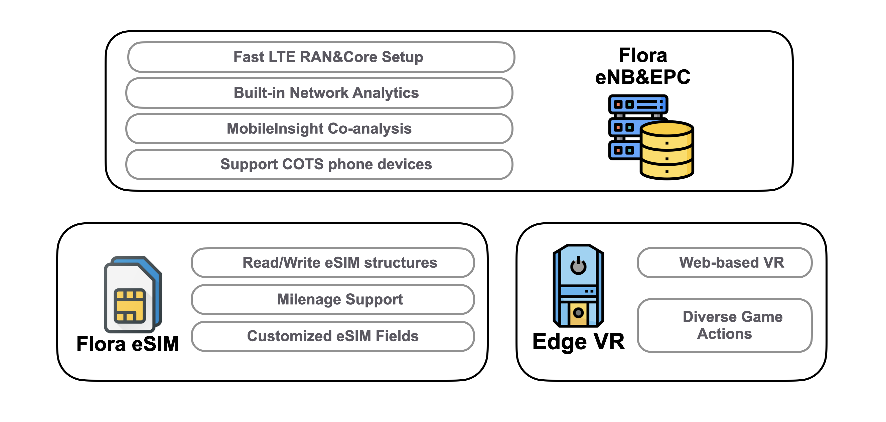
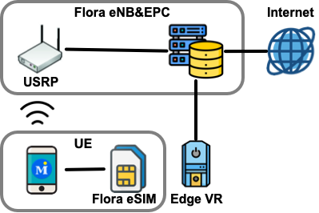

# Flora: Flexible Mobile Network Platform 


## Introduction
Flora is an open and software-defined 4G LTE/5G software networked system without commodity SIM cards, communication chipsets and dedicated infrastructure equipment. It provides a quick solution to setup a testbed based on OAI and Magma.
Three salient features of our system are as follows:
- Built-in network analytics at both the device and the infrastructure, which provides runtime solutions to both what and why on network behaviors
- Customized system that allows the operators to optimize system latency and reliability
- New system-in-the-chain security that fixes the current broken 4G/5G design that poses security risks



For more detailed introduction, please refer to our documentation.


## Testbed Setup

Flora now supports Ubuntu 16 and Ubuntu 18. 
We currently only support USRP SDR. USRP B210 and X300 have been tested successfully.



Flora provides a quick one-step installation script. To run it, simply do

```bash
    [flora]$ cd testbed-setup/scripts/OAI
    [flora/testbed-setup/scripts/OAI]$ chmod +x install.sh
    [flora/testbed-setup/scripts/OAI]$ ./install.sh
```


This script will install all the necessary prerequisite software and Flora. To start the system, connect USRP to the computer via USB 3, and run
```bash
    [flora]$ cd testbed-setup/scripts/OAI
    [flora/testbed-setup/scripts/OAI]$ chmod +x install.sh
    [flora/testbed-setup/scripts/OAI]$ ./run.sh
```

To connect a phone device to the testbed, you can purchase a blank Javacard and download the software from [link](http://metro.cs.ucla.edu/codeshare.html). Write the correct credential into the Javacard as instructed. Insert the programmed Javacard into any commercial off-the-shelf device and connect to our testbed. For more details, see our [documentation](https://project-flora.github.io/flora/quick_start/).


## Base Station Analysis and Edge Computing 
Flora supports in-depth base station analysis with costomizable analyzers. 
We also provide example applications for edge computing.
For usage, please check our [documentation](https://project-flora.github.io/flora/quick_start/).


## Join the Community
If you have any technical issue, please go to [Issues](https://github.com/project-flora/flora/issues).
For any other question, please contact projectfloranetwork@gmail.com.


## License
Flora is Apache 2.0 licensed, as found in the LICENSE file. The eNB part of Flora is offered under the OAI Apache 2.0 license ([link](https://gitlab.eurecom.fr/oai/openairinterface5g/-/blob/master/LICENSE)). The EPC part of Flora is offered under the Magma BSD license ([link](https://github.com/magma/magma/blob/master/LICENSE)).

